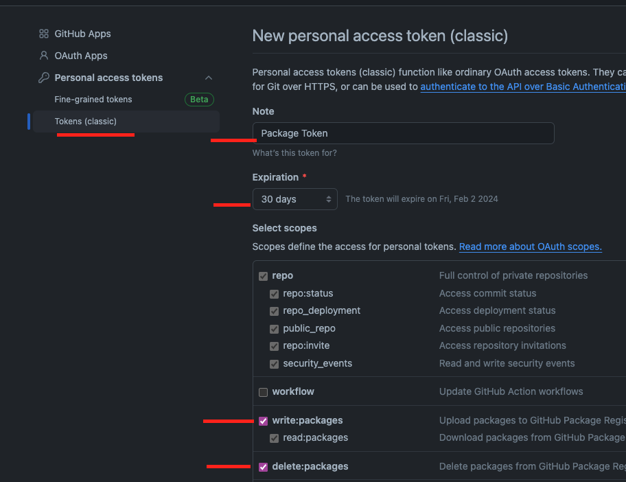
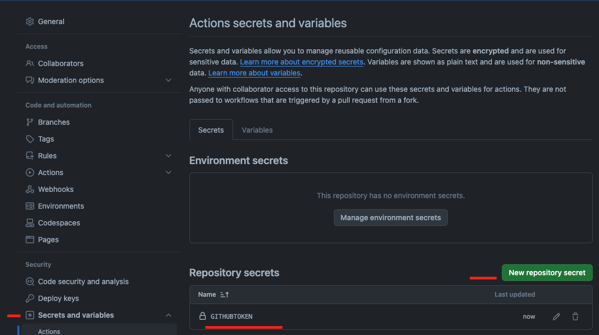

# Configurar un parquete en github paso a paso

## 1- Iniciar el proyecto ya sea de react o de node
Debe haber un archivo index que exporte las clases, componentes o funciones.

## 2- Debes configurar el repository en el archivo package.json agengando la siguiente linea:
Debes cambiar username y repository por los valores correspondientes, tambien puedes entrar a la url del repositorio y copiar el link que aparece en el boton de clone.
Lugo debes agregarle .git al final.
EL package-look.json tambien debe quedar con el mismo nombre.
```json
"name": "@USERNAME/REPONAME",
"repository": {
  "type": "git",
  "url": "https://github.com/USERNAME/REPONAME.git"
},
```

## 3- Configurar el publishConfig en el package.json
Debes cambiar username por el valor correspondiente.
```json
"publishConfig": {
"registry": "https://npm.pkg.github.com/@USERNAME"
},
```

## 4- Crear un archivo .npmrc en la raiz del proyecto o con los git actions:
Debes cambiar NAMESPACE por username o el nombre de la org y token por los valores correspondientes.
```text
//npm.pkg.github.com/:_authToken=${NODE_AUTH_TOKEN}
@NAMESPACE:registry=https://npm.pkg.github.com
always-auth=true
```
#### 4.1- En este paso debes crear un token en github, para esto debes ir a la configuracion de tu cuenta, luego a developer settings y por ultimo a personal access tokens.
Debes crear un token con los siguientes permisos:
- repo
- write:packages
- read:packages
- delete:packages


#### 4.2- Luego debes copiar el token y guardarlo en una variable de entorno en github, para esto debes ir a la configuracion del repositorio, luego a secrets y por ultimo a new repository secret.
GITHUB_TOKEN=token


## 5- Crear un archivo .gitignore en la raiz del proyecto
Debes agregar las siguientes lineas:
```text
node_modules
dist
```

## 6- Crear un repo y subir los cambios, y luego publicar el paquete
```bash
npm publish
```